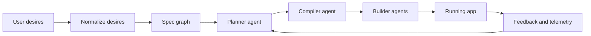
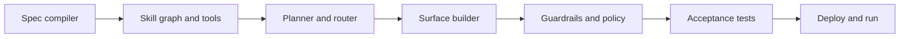
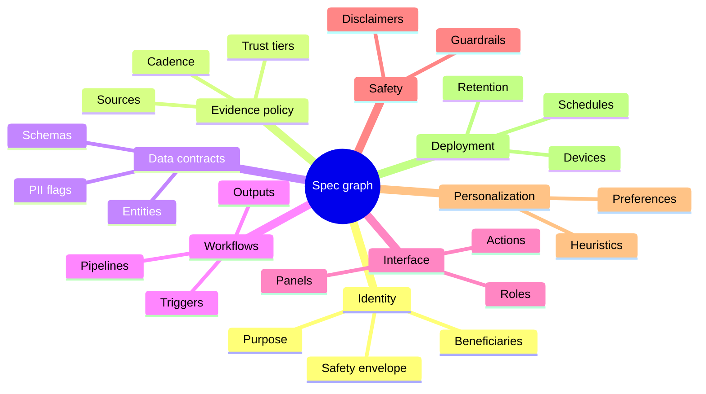
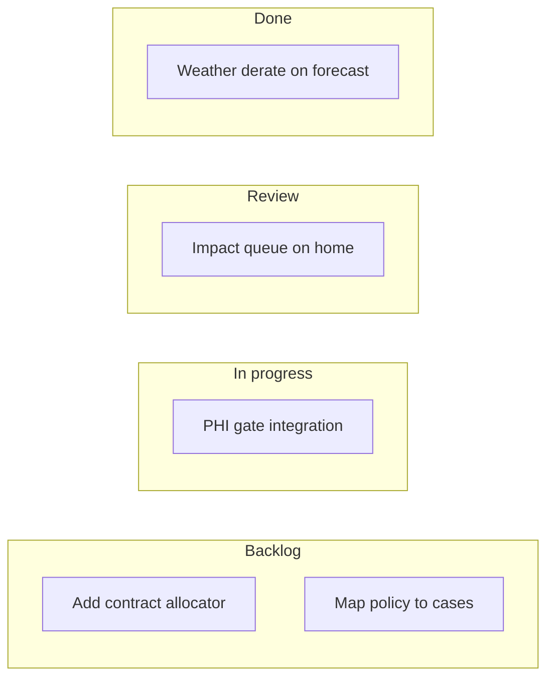
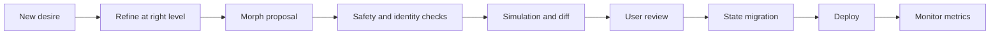
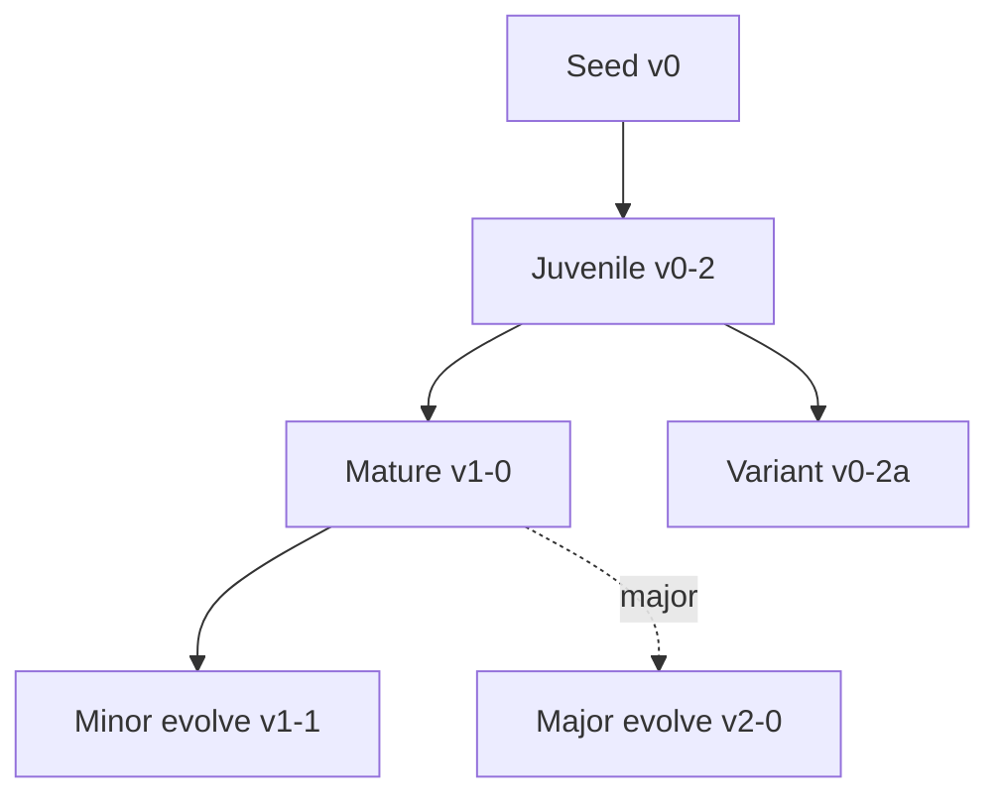
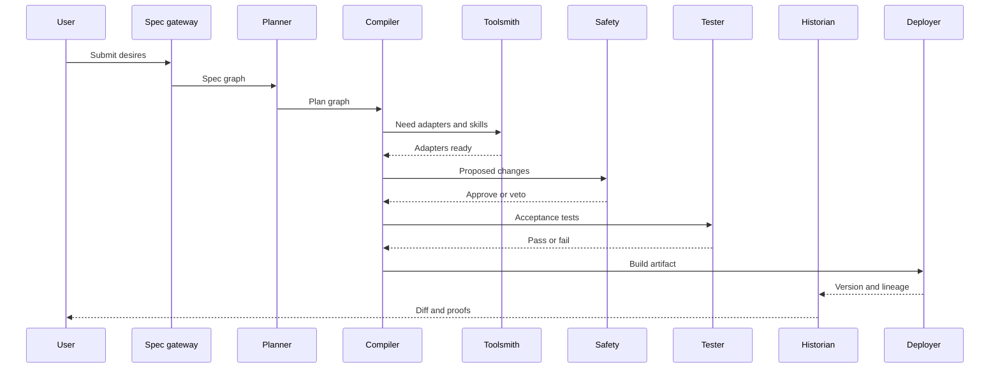
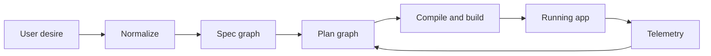

# Factory — A Spec-Driven Agent Factory for **Living Apps**

**Factory** turns **user desires** into **running applications** that keep working, learning, and adapting.
Instead of treating **code** as the source of truth, Factory stores a **semantic specification** of what the user wants and **compiles** it into data pipelines, workflows, and UI surfaces (flowcharts, mindmaps, kanban-style boards). Multiple cooperating **coding agents (LLMs)** translate the spec into software, verify it, and evolve it safely over time.

---

## ✨ TL;DR

- **Truth = User Desires.** Code is a compiled artifact.
- **Semantic Spec Graph.** Typed, versioned, and renderable as flowchart, mindmap, or kanban.
- **Agent Crew.** Planner, Compiler, Toolsmith, Surface, Safety, Tester, Historian.
- **Growth, not patches.** Apps follow a **Developmental Spec** with identity invariants, “organs,” and “growth plates.”
- **Why this matters.** Traditional “code-first” AI assistants make life hard for users **and** LLMs; Factory is built for both.

---

## Why Factory (and why “code-first” hinders users _and_ LLMs)

Traditional AI coding assistants assume **code is the source of truth**: natural language is merely a way to edit files. That forces users to think in APIs and commits and forces LLMs to **reverse-engineer intent from volatile code diffs**. Small changes become brittle. Big changes become risky.

Factory flips the model:

- Users articulate **desires** (goals, constraints, evidence, outputs).
- Desires normalize into a **hierarchical spec** (domain, evidence policy, data contracts, workflows, surfaces, safety, personalization, deployment).
- The spec becomes the **semantic source of truth**; **agents** compile it into code and continuously maintain it.
- Big shifts happen at the **right abstraction level** with guardrails and proofs.

---

## System Overview

### From **User Desires** to **Running App**



- **Normalize desires** → typed nodes and relations in the **Spec Graph**
- **Planner** → builds a plan graph from the spec
- **Compiler** → translates plan into workflows, data contracts, surfaces
- **Builders** → generate code, adapters, and configurations
- **Feedback** → informs future plans and defaults

### The Factory “Assembly Line”



---

## The Spec: **User Desires** → **Hierarchical Semantic Graph**

- **User Desire**: atomic, human-readable intent

  - `goal`, `constraints`, `trusted_sources`, `outputs`, `cadence`, `preferences`

- **Hierarchy** (typed graph):

  - **Domain** → **EvidencePolicy** → **DataContracts** → **Workflows** → **Interface** → **Safety** → **Personalization** → **Deployment**

- **Storage**: semantic DB with types, relations, provenance, and versions
- **Rendering**: same spec can be shown as **flowchart**, **mindmap**, or **kanban** to match user context

#### Mindmap render (same spec, different view)



#### Kanban-style render of a growth plan (flowchart alternative for GitHub reliability)



> Note: We use a flowchart with subgraphs as a **kanban-style** representation to ensure rendering works in most Markdown viewers.

---

## Developmental Spec & Growth Engine

_Apps grow like organisms. They do not mutate identity at random._

Think **children → adolescents → adults**: big changes happen at the right abstraction layer, while **identity stays stable**. An **elephant** can mature and gain capabilities—but it is **never** turned into a **mouse**.

- **Identity invariants**: purpose, beneficiaries, safety envelope, prohibited changes
- **Organs**: subsystems like ingestors, reasoners, workflows, surfaces, actions, safety
- **Growth plates**: typed extension points (add source, swap allocator, add panel)
- **Morph rules**: allowed transformations with risk levels and required tests
- **Lineage**: versioned stages and branches with migration and rollback

### Growth pipeline (desire → safe deploy)



### Lineage and stages



---

## Agent Crew (multiple LLMs, clear contracts)



**Roles**

- **Planner**: maps desires → morphs at the correct level (goal, policy, mechanism)
- **Compiler**: translates morphs into workflows, contracts, surfaces
- **Toolsmith**: creates adapters and skills for tools and data
- **Surface**: composes UI panels from the plan
- **Safety**: enforces identity invariants and guardrails
- **Tester**: generates acceptance tests and migration checks
- **Historian**: tracks lineage, versions, and readable diffs

---

## Examples (what Factory builds, not how)

- **Farmer, contract-first allocation**: add **Contracts** source, **PHI gate**, allocate to Tuesday buyers first, route surplus by price, generate packlists, deliveries, invoices
- **Immigration, policy impact on cases**: map **policy updates** to **active cases**, create **action plans** and **client drafts**, elevate impacts on the home screen

(See `/examples` for full specs.)

---

## Spec Schema (core types, minimal)

```yaml
identity:
  purpose: "Farm planning and evidence aware operations"
  beneficiaries: ["Farmer", "Buyers"]
  safety_envelope: ["No medical claims", "No legal advice"]
  prohibited_changes: ["Change business purpose"]

evidence_policy:
  sources: ["gov data", "peer reviewed", "trusted blogs"]
  trust_tiers: ["high", "medium", "low"]
  cadence: "daily"

data_contracts:
  entities:
    - name: "Contract"
      fields:
        [
          "buyer",
          "sku",
          "qty_per_week",
          "price_floor",
          "delivery_day",
          "priority",
        ]
    - name: "Block"
      fields: ["crop", "cultivar", "plant_count"]
    - name: "SprayEvent"
      fields: ["block_id", "product", "date", "phi_days"]

workflows:
  pipelines:
    - name: "Contract allocation"
      steps:
        - "Yield forecast"
        - "PHI gate"
        - "Allocate to contracts"
        - "Surplus allocator"
        - "Packlists"
        - "Route plan"
        - "Invoices"
interface:
  panels: ["Triage", "Brief", "Comparator", "Checklist", "Composer"]
safety:
  guardrails: ["No harvest from PHI locked blocks"]
personalization:
  preferences: ["RFC style notes", "No jira links"]
deployment:
  cadence: "nightly"
  devices: ["web", "mobile"]
```

---

## How specs render (flowchart example)



---

## Repository Layout

```
/apps
  /web-ui            # Next.js or similar, Worldsheet surfaces
  /control-plane     # spec gateway, planner, compiler APIs
  /workers           # background jobs, refreshers, diffs
/packages
  /spec-core         # types, schema, identity invariants, graph ops
  /agents            # agent prompts, scaffolds, orchestration
  /skills            # reusable skills: triage, compare, brief, checklist
  /adapters          # github, slack, calendar, drive, web
  /safety            # guardrails, policy checks
  /testing           # acceptance test DSL and runners
/examples
  /farmer-contract-allocation
  /immigration-policy-impact
```

---

## API Sketch

- `POST /spec/normalize` → desires → spec graph
- `POST /growth/plan` → spec graph → morph plan
- `POST /growth/simulate` → plan → diff report
- `POST /growth/deploy` → plan → build + migrate + deploy
- `GET  /lineage/:id` → lineage JSON
- `GET  /render/:id?mode=flowchart|mindmap|board` → diagram payload

---

## Agent Contracts (pseudo)

```json
// Planner input
{
  "spec_graph_id": "sg-001",
  "new_desires": [
    {
      "goal": "reserve tuesday contracts first",
      "constraints": ["phi compliant"],
      "outputs": ["packlists", "invoices"]
    }
  ]
}
```

```json
// Planner output → Compiler input
{
  "morphs": [
    { "type": "add_source", "name": "contracts" },
    { "type": "insert_gate", "name": "phi_gate", "after": "yield_forecast" },
    { "type": "allocate", "strategy": "priority" },
    { "type": "add_surface", "panels": ["contract_tracker", "price_spread"] }
  ],
  "tests": [
    "no harvest from phi locked blocks",
    "all tuesday contracts have reservation or shortfall alert"
  ]
}
```

---

## Acceptance Tests (examples)

- “No harvest from PHI locked blocks.”
- “All Tuesday contracts reserved or shortfall alert created.”
- “Invoices generated for reserved buyers.”
- “Impacted cases appear at top with next action and due date.”

---

## Growth Engine Guarantees

- **Identity invariants enforced**: elephants do not become mice
- **Simulation before deploy**: diffs, risks, and screenshots
- **Migration with rollback**: deterministic transforms
- **Readable diffs**: spec-level “mutation PRs,” not opaque code diffs

---

## Getting Started

1. **Clone** and install deps (`pnpm i` or `npm i`).
2. **Run control plane** and **web UI**.
3. Submit a **User Desire** via the UI (or `POST /spec/normalize`).
4. Inspect the **Spec Graph** renders (flowchart, mindmap, board).
5. Generate a **Growth Plan**, simulate, and deploy.
6. Explore the **Historian** diff and lineage views.

_(Exact commands depend on your stack; see `/apps/web-ui/README.md` and `/apps/control-plane/README.md`.)_

---

## FAQ

**Is this just another code generator?**
No. Factory stores **intent** as a semantic graph and compiles code from it. The graph is the source of truth.

---

## Daytona Code Execution (Evals)

This repo includes a lightweight server-side integration with Daytona to execute generated code in isolated sandboxes for evals.

- API route: `POST /api/evals/execute`
- Env vars: set `DAYTONA_API_KEY` (and optionally `DAYTONA_API_URL`, `DAYTONA_TARGET`).
- Default security: network blocked in the sandbox unless `network.blockAll` is set to `false`.

Example request body:

```
{
  "language": "python",             // "python" | "typescript" | "javascript" (default: python)
  "code": "print('hello from eval')", // or use "command" instead of "code"
  "argv": ["--flag"],
  "env": { "MY_FLAG": "1" },
  "timeout": 10,                      // seconds
  "files": [
    { "path": "data/input.json", "content": "{\"k\":1}" }
  ],
  "network": { "blockAll": true }    // default true; set false to allow outbound
}
```

Response shape:

```
{
  "ok": true,
  "exitCode": 0,
  "stdout": "hello from eval\n",
  "artifacts": {
    "stdout": "hello from eval\n",
    "charts": []
  }
}
```

Notes:

- Uses `@daytonaio/sdk` to spin up an ephemeral sandbox, run the snippet/command, then deletes the sandbox.
- For Python, matplotlib output is parsed into `artifacts.charts` when applicable.
- You can upload small input files via `files[]` prior to execution.

Smoke test:

- Start the dev server: `npm run dev`
- In another shell: `npm run smoke:evals`

**Why multiple LLMs?**
Different tasks require different reasoning and context windows. Clear agent contracts make outputs auditable and safer.

**Can I still edit code?**
Yes, but edits flow **through the spec**. Code diverging from the spec will be re-converged or rejected by Safety.

**Do I have to use mindmaps or kanban?**
No; they are alternate renders of the same spec for the right **level of abstraction** at the right time.

---

## Idea

Built with the idea that **apps should grow like organisms**: **identity preserved, capabilities evolving**—and that **user desires** should be the ground truth both humans and LLMs reason about.
